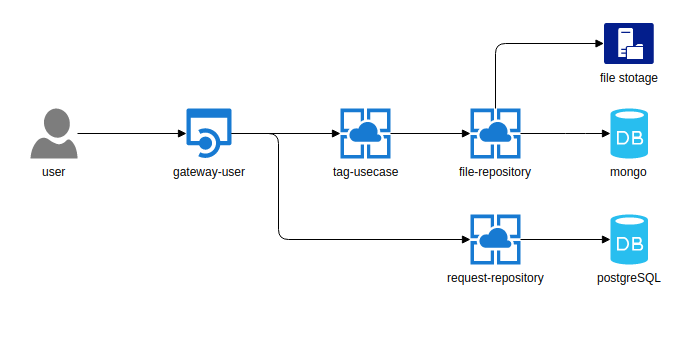

# Tag service

You can see this project at the link:  
  
[mp3tags.org](http://www.mp3tags.org)  
  
# Architecture

# Menu 

[Services]()  

  * [gateway-user](#gateway-user)
  * [tag-usecase](#tag-usecase)
  * [file-repository](#file-respository)
  * [request-repository](#request-repository)
  
# gateway-user

We use go-swagger for gateway api code generation  
  
Specifiaction: [gateway-user-specification](https://github.com/mp3tags/gateway-user-specification)  
Release: [gateway-user](https://github.com/mp3tags/gateway-user)  

# tag-usecase

It`s gRPC service.  

Proto: [tag-usecase-proto](https://github.com/mp3tags/tag-usecase-proto)  
Release: [tag-usecase](https://github.com/mp3tags/tag-usecase)

# file-respository

It`s gRPC service.  

Proto: [file-respository-proto](https://github.com/mp3tags/file-respository-proto)  
Release: [file-respository](https://github.com/mp3tags/file-respository)  

# request-respository

It`s gRPC service.  

Proto: [request-respository-proto](https://github.com/mp3tags/request-respository-proto)  
Release: [request-respository](https://github.com/mp3tags/request-respository)    