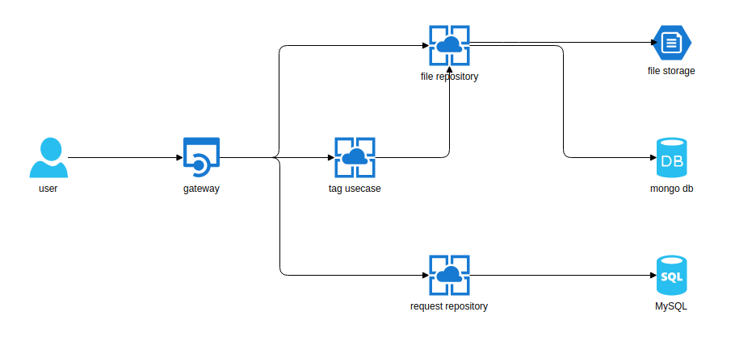

# Tag service

You can see this project at the link:  
  
[mp3tags.org](http://www.mp3tags.org)  
  
# Architecture

# Menu 

[Services]()  

  * [gateway-user](#gateway-user)
  * [tag-usecase](#tag-usecase)
  * [file-repository](#file-repository)
  * [request-repository](#request-repository)
  
# gateway-user

We use go-swagger for gateway api code generation  
  
Specifiaction: [gateway-user-specification](https://github.com/mp3tags/gateway-user-specification)  
Release: [gateway-user](https://github.com/mp3tags/gateway-user)  

# tag-usecase

It`s gRPC service.  

Proto: [tag-usecase-proto](https://github.com/mp3tags/tag-usecase-proto)  
Release: [tag-usecase](https://github.com/mp3tags/tag-usecase)

# file-repository

It`s gRPC service.  

Proto: [file-repository-proto](https://github.com/mp3tags/file-respository-proto)  
Release: [file-repository](https://github.com/mp3tags/file-respository)  

# request-repository

It`s gRPC service.  

What we use:
1. MySQL version 5.7.27  
2. Proto version 3
3. Golang version 1.12  
  
Proto: [request-repository-proto](https://github.com/mp3tags/request-respository-proto)  
Release: [request-repository](https://github.com/mp3tags/request-respository)    